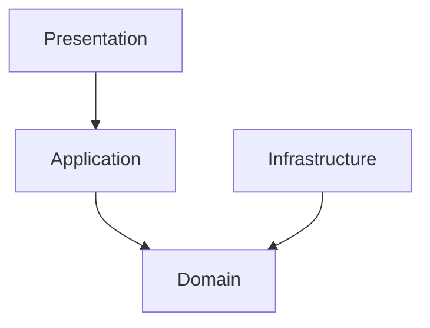

# CustomerOrderSystem 

Este es un proyecto API backend diseñado para gestionar clientes y sus ordenes, aplicando conceptos de arquitectura limpia, separación de responsabilidades, escalabilidad, y mantenibilidad, siguiendo los lineamientos de un buen diseño de software.

El objetivo del proyecto es exponer una base sólida y bien estructurada para operaciones comunes como la creación de clientes, la gestión de órdenes y la aplicación de reglas de negocio.

## Tecnologías Utilizadas

- Lenguaje: C#
- Framework: .NET 6
- Base de Datos: InMemoryDatabase (desarrollo), SQL Server (próximamente en producción)
- ORM: Entity Framework Core
- Patrón de Arquitectura: Arquitectura Limpia (Clean Architecture)
- Control de Versiones: Git

## Estructura del Proyecto

El proyecto está organizado en varias capas para asegurar una clara separación de responsabilidades:
- **Domain**: Contiene las entidades del dominio, interfaces de repositorios y servicios, y reglas de negocio.
- **Application**: Implementa los casos de uso, servicios de aplicación e identidades.     
- **Infrastructure**: Implementa la persistencia de datos, servicios externos y configuraciones específicas de infraestructura.
- **Presentation**: Exposición de los endpoints en controladores y configuración de la API.    
- **Tests**: Pruebas unitarias e integrales.

### Diagrama de la Arquitectura



## Cómo ejecutar el proyecto:
1. **Restaurar**: `dotnet restore`
2. **Ejecutar**:
   ```bash
   dotnet run --project src/CustomerOrderSystem.Presentation
   ```
3. **Probar**: Abre tu navegador en `https://localhost:7188/swagger` (revisa el puerto en la consola).

## Ejecutar tests
`dotnet test`

## Scripts y Datos
- **data/**: Contiene el archivo `sample-requests.json` con ejemplos de peticiones para probar la API.
- **scripts/**: Contiene `verify-and-start.ps1`, un script sencillo para ejecutar pruebas y arrancar el proyecto en un solo paso.

 
## Endpoints

### Customer
- `GET /api/Customer` - Obtiene todos los clientes
- `GET /api/Customer/{id}` - Obtiene un cliente por su ID
- `POST /api/Customer` - Crea un nuevo cliente

### Order
- `POST /api/Order/{customerId}` - Crea una nueva orden para un cliente
- `PUT /api/Order/{orderId}/cancel` - Cancela una orden existente

## Pendientes

- Completar más casos de borde en tests de integración
- Configuración para SQL Server en producción


## Ejemplo de uso

```json
{
  "description": "Ejemplos de requests para la API",
  "createCustomer": {
    "method": "POST",
    "url": "/api/Customer",
    "body": {
      "name": "Guillermo Madariaga",
      "email": "guille@test.com"
    }
  },
  "getCustomers": {
    "method": "GET",
    "url": "/api/Customer"
  },
  "getCustomerById": {
    "method": "GET",
    "url": "/api/Customer/{id}"
  },
  "createOrder": {
    "method": "POST",
    "url": "/api/Order/{customerId}",
    "description": "Crear una nueva orden para un cliente"
  },
  "cancelOrder": {
    "method": "PUT",
    "url": "/api/Order/{orderId}/cancel",
    "description": "Cancelar una orden existente"
  },
  "completeOrder": {
    "method": "PUT",
    "url": "/api/Order/{orderId}/complete",
    "description": "Completar una orden existente"
  }
}
```


## TODO: Mejoras a implementar

Persistencia más robusta (SQL Server): Configurar *AppDbContext* usando variables de entorno para un manejo más seguro y flexible de la base de datos.

Mejorar las validaciones en el dominio: Agregar validaciones internas  en las entidades para controlar que las reglas de negocio se cumplan desde el núcleo.

Optimizar presentación y mapeo: Estandarizar el uso de DTOs en todos los endpoints para mantener consistencia y claridad en la comunicación entre capas. 

Mejorar el  Manejo de excepciones: Implementar un middleware de excepciones que reduzca el uso de *try-catch* en los controladores, mejorando la mantenibilidad y el rendimiento. 

Docuentar los endpoints: Agregar documentación detallada de los endpoints para facilitar la comprensión y uso de la API en el Swagger.