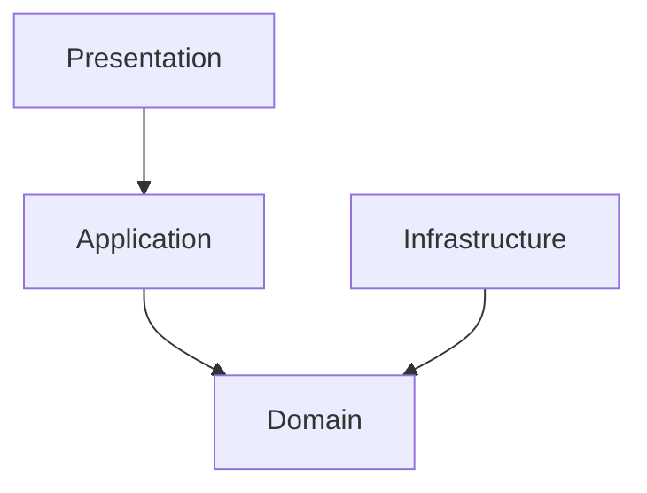

# CustomerOrderSystem 

Este es un proyecto API backend diseñado para gestionar clientes y sus ordenes, aplicando conceptos de arquitectura limpia, separación de responsabilidades, escalabilidad, y mantenibilidad, siguiendo los lineamientos de un buen diseño de software.

El objetivo del proyecto es exponer una base sólida y bien estructurada para operaciones comunes como la creación de clientes, la gestión de órdenes y la aplicación de reglas de negocio.

## Tecnologías Utilizadas

- Lenguaje: C#
- Framework: .NET 6
- Base de Datos: InMemoryDatabase (desarrollo), SQL Server (próximamente en producción)
- ORM: Entity Framework Core
- Patrón de Arquitectura: Arquitectura Limpia (Clean Architecture)
- Control de Versiones: Git

## Estructura del Proyecto

El proyecto está organizado en varias capas para asegurar una clara separación de responsabilidades:
- **Domain**: Contiene las entidades del dominio, interfaces de repositorios y servicios, y reglas de negocio.
- **Application**: Implementa los casos de uso, servicios de aplicación e identidades.     
- **Infrastructure**: Implementa la persistencia de datos, servicios externos y configuraciones específicas de infraestructura.
- **Presentation**: Exposición de los endpoints en controladores y configuración de la API.    
- **Tests**: Pruebas unitarias e integrales.

### Diagrama de la Arquitectura



## Cómo ejecutar el proyecto:

### Opción 1: Inicio Automatizado (Recomendado)
Ejecuta el script incluido para validar el sistema y abrir el navegador automáticamente:
```powershell
./scripts/verify-and-start.ps1
```

### Opción 2: Ejecución estándar
1. **Restaurar**: `dotnet restore`
2. **Ejecutar**:
   ```bash
   dotnet run --project src/CustomerOrderSystem.Presentation
   ```
3. **Probar**: Abre tu navegador en `https://localhost:7188` (la raíz redirige a Swagger).

## Ejecutar tests
`dotnet test`

## Configuración de Base de Datos (Modo Dual)

El sistema está configurado para operar de dos formas, permitiendo una evaluación rápida o una prueba en un entorno real:

*Modo In-Memory, Predeterminado*: Ideal para ejecución inmediata
1. *Modo SQL Server*: Para persistencia sql server.

### Cómo activar SQL Server:
1. Crear un archivo llamado `appsettings.json` en `src/CustomerOrderSystem.Presentation/` (por favor usar `appsettings.template.json` como guía). **Nota**: Este archivo está excluido del repositorio por seguridad.
2. En dicho archivo, cambia `"UseSqlServer": false` a `true`.
3. Asegúrate de que la cadena de conexión `DefaultConnection` apunta a tu servidor local.
4. Ejecuta las migraciones para crear la base de datos. **Importante**: El comando creará automáticamente la base de datos con el nombre indicado (ej. `CustomerOrderSystem`) si esta aún no existe en tu servidor:
   ```bash
   dotnet ef database update --project src/CustomerOrderSystem.Infrastructure --startup-project src/CustomerOrderSystem.Presentation
   ```

## Scripts y Datos
- **data/**: Contiene el archivo `sample-requests.json` con ejemplos de peticiones para probar la API.
- **scripts/**: Contiene `verify-and-start.ps1`, un script sencillo para ejecutar pruebas y arrancar el proyecto en un solo paso.

 
## Endpoints

### Customer
- `GET /api/Customer` - Obtiene todos los clientes
- `GET /api/Customer/{id}` - Obtiene un cliente por su ID
- `POST /api/Customer` - Crea un nuevo cliente

### Order
- `POST /api/Order/{customerId}` - Crea una nueva orden para un cliente
- `PUT /api/Order/{orderId}/cancel` - Cancela una orden existente

## Pendientes

- Completar más casos de borde en tests de integración
- Configuración para SQL Server en producción


## Ejemplo de uso

```json
{
  "description": "Ejemplos de requests para la API",
  "createCustomer": {
    "method": "POST",
    "url": "/api/Customer",
    "body": {
      "name": "Guillermo Madariaga",
      "email": "guille@test.com"
    }
  },
  "getCustomers": {
    "method": "GET",
    "url": "/api/Customer"
  },
  "getCustomerById": {
    "method": "GET",
    "url": "/api/Customer/{id}"
  },
  "createOrder": {
    "method": "POST",
    "url": "/api/Order/{customerId}",
    "description": "Crear una nueva orden para un cliente"
  },
  "cancelOrder": {
    "method": "PUT",
    "url": "/api/Order/{orderId}/cancel",
    "description": "Cancelar una orden existente"
  },
  "completeOrder": {
    "method": "PUT",
    "url": "/api/Order/{orderId}/complete",
    "description": "Completar una orden existente"
  }
}
```


## TODO: Mejoras que se pueden implementar


Optimizar presentación y mapeo: Estandarizar el uso de DTOs en todos los endpoints para mantener consistencia y claridad en la comunicación entre capas. 


Se puede Mapear de forma automática usando AutoMapper o similar.